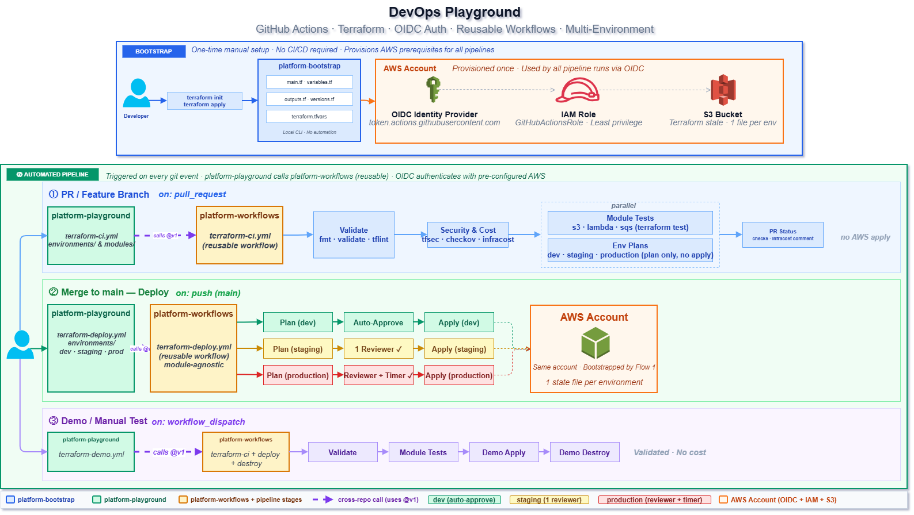

# platform-playground

> **Role:** Reference implementation and consumer of [platform-bootstrap](https://github.com/BOlimpio/platform-bootstrap) and [Platform Workflows](https://github.com/BOlimpio/platform-workflows). Demonstrates a production-grade Terraform project with multi-environment deployments, reusable modules, and a comprehensive CI/CD pipeline.

This repository is designed to be a **learning reference** and **starting point** for real Terraform projects. It showcases the full ecosystem: OIDC authentication, approval gates, cost estimation, security scanning, compliance-as-code, and automated testing — all wired together.

---

## Table of Contents

- [Architecture Overview](#architecture-overview)
- [Repository Structure](#repository-structure)
- [Environments](#environments)
- [Terraform Modules](#terraform-modules)
- [CI/CD Pipeline](#cicd-pipeline)
- [Testing Strategy](#testing-strategy)
- [Security and Compliance](#security-and-compliance)
- [Cost Estimation](#cost-estimation)
- [How to Deploy](#how-to-deploy)
- [How to Destroy](#how-to-destroy)
- [Extending the Project](#extending-the-project)
- [Local Development](#local-development)
- [Learning Topics](#learning-topics)

---

## Architecture Overview

```
┌─────────────────────────────────────────────────────────────────────┐
│                        platform-playground                           │
│                                                                      │
│  ┌──────────────────────────────────────────────────────────────┐   │
│  │  environments/                                                │   │
│  │                                                              │   │
│  │  dev/           staging/         production/                 │   │
│  │  ├── VPC        ├── VPC          ├── VPC                     │   │
│  │  ├── S3 (x3)    ├── S3 (x3)      ├── S3 (x3)                │   │
│  │  ├── SQS+DLQ    ├── SQS+DLQ      ├── SQS+DLQ                │   │
│  │  └── Lambda     └── Lambda        └── Lambda                 │   │
│  │                                                              │   │
│  │  Each environment = one root module = one Terraform state    │   │
│  └──────────────────────────────────────────────────────────────┘   │
│                                                                      │
│  ┌───────────────────────────────────────────────────────────┐      │
│  │  modules/aws/                                             │      │
│  │  ├── s3/       Configurable S3 bucket (encryption, versioning,  │
│  │  │             lifecycle, CORS, object lock)              │      │
│  │  ├── sqs/      SQS queue with optional DLQ + SSE          │      │
│  │  └── lambda/   Lambda function with IAM role, DLQ, X-Ray  │      │
│  └───────────────────────────────────────────────────────────┘      │
│                                                                      │
│  ┌───────────────────────────────────────────────────────────┐      │
│  │  compliance/features/                                     │      │
│  │  ├── tagging.feature         All resources must be tagged │      │
│  │  ├── encryption.feature      S3 and SQS must be encrypted │      │
│  │  ├── backup.feature          Versioning and DLQ required  │      │
│  │  └── network_security.feature  S3 public access blocked   │      │
│  └───────────────────────────────────────────────────────────┘      │
└─────────────────────────────────────────────────────────────────────┘
         │                  │                  │
         ▼                  ▼                  ▼
    terraform-ci      terraform-deploy   terraform-destroy
    (platform-workflows — consumed via workflow_call)
```

The diagram below shows the full ecosystem across both execution flows — the one-time bootstrap and the automated pipeline triggered on every git event:



---

## Repository Structure

```
platform-playground/
├── .github/
│   └── workflows/
│       ├── terraform-consumer.yml   # Main CI/CD — calls platform-workflows
│       └── terraform-demo.yml       # Demo/testing workflow for modules
│
├── environments/
│   ├── dev/
│   │   ├── main.tf                 # VPC + S3 + SQS + Lambda composition
│   │   ├── variables.tf            # Environment-specific variables
│   │   ├── outputs.tf              # All resource outputs (VPC, S3, SQS, Lambda)
│   │   ├── versions.tf             # S3 backend + provider configuration
│   │   ├── terraform.tfvars.example
│   │   └── tests/
│   │       ├── plan.tftest.hcl     # Fast plan tests (no AWS resources)
│   │       └── apply.tftest.hcl    # Integration tests (creates real resources)
│   ├── staging/                    # Same structure as dev
│   └── production/                 # Same structure as dev
│
├── modules/
│   └── aws/
│       ├── s3/
│       │   ├── main.tf
│       │   ├── variables.tf        # 15+ configurable inputs with validation
│       │   ├── outputs.tf          # bucket ID, ARN, encryption/versioning status
│       │   ├── versions.tf
│       │   └── tests/
│       │       ├── plan.tftest.hcl
│       │       └── apply.tftest.hcl
│       ├── sqs/
│       │   ├── main.tf
│       │   ├── variables.tf
│       │   ├── outputs.tf
│       │   ├── versions.tf
│       │   └── tests/
│       │       └── plan.tftest.hcl
│       └── lambda/
│           ├── main.tf
│           ├── variables.tf
│           ├── outputs.tf
│           ├── versions.tf
│           └── tests/
│               └── plan.tftest.hcl
│
├── examples/
│   ├── s3/main.tf                  # Standalone S3 example with full config
│   ├── sqs/main.tf                 # Standalone SQS example with DLQ
│   └── lambda/main.tf              # Standalone Lambda example with event processor
│
├── compliance/
│   └── features/
│       ├── README.md
│       ├── tagging.feature
│       ├── encryption.feature
│       ├── backup.feature
│       └── network_security.feature
│
├── .tflint.hcl                     # TFLint rules (naming, documentation, types)
├── .checkov.yaml                   # Checkov skip rules with justifications
├── .pre-commit-config.yaml         # Pre-commit hooks (fmt, validate, tflint, checkov)
└── infracost.yml                   # Infracost project configuration
```

---

## Environments

Each environment is a **Terraform root module** — a self-contained directory with its own state, backend configuration, and variable values.

### Unified Root Module Pattern

Rather than splitting infrastructure across multiple state files (one for networking, one for compute, etc.), each environment uses a single root module that composes all resources:

```hcl
# environments/dev/main.tf (simplified)

# Networking
resource "aws_vpc" "main" { ... }
resource "aws_subnet" "public" { count = 2, ... }
resource "aws_nat_gateway" "main" { ... }

# Storage (via modules)
module "logs_bucket"   { source = "../../modules/aws/s3", ... }
module "data_bucket"   { source = "../../modules/aws/s3", ... }
module "static_bucket" { source = "../../modules/aws/s3", ... }

# Messaging
module "event_queue" {
  source      = "../../modules/aws/sqs"
  queue_name  = "tcip-${var.environment}-events"
  enable_dlq  = true
}

# Compute
module "event_processor" {
  source               = "../../modules/aws/lambda"
  function_name        = "tcip-${var.environment}-processor"
  dead_letter_queue_arn = module.event_queue.dlq_arn
  enable_dlq_policy    = true
}
```

**Benefits of this approach:**
- Single `terraform plan` / `terraform apply` deploys the complete environment
- Resources in the same state can reference each other directly (e.g., Lambda uses SQS ARN)
- Easier to understand: one directory = one complete environment
- Mirrors how teams actually deploy: "deploy everything for dev"

### State per Environment

```
S3 bucket: platform-playground-shared-state
├── environments/dev/terraform.tfstate
├── environments/staging/terraform.tfstate
└── environments/production/terraform.tfstate
```

Each state file is independent. Destroying dev doesn't affect staging or production.

### Environment Differences

| Feature | dev | staging | production |
|---|---|---|---|
| Approval required | No | Yes (1 reviewer) | Yes (1 reviewer) |
| Wait timer | None | None | 1 minute |
| Branch restriction | None | None | Protected branches only |
| Terraform state | S3 `environments/dev/` | S3 `environments/staging/` | S3 `environments/production/` |

---

## Terraform Modules

### `modules/aws/s3`

A configurable S3 bucket module with comprehensive security defaults.

**Key features:**
- Server-side encryption enabled by default (AES-256 or KMS)
- Versioning enabled by default
- Public access blocked by default
- Optional: access logging, lifecycle rules, CORS, object lock (WORM)
- Input validation: bucket naming rules, KMS ARN format, lifecycle configuration

**Usage:**
```hcl
module "my_bucket" {
  source      = "../../modules/aws/s3"
  bucket_name = "my-app-data-${var.environment}"

  enable_versioning   = true
  enable_encryption   = true
  encryption_type     = "AES256"
  block_public_access = true

  lifecycle_rules = [{
    id      = "expire-old-versions"
    enabled = true
    noncurrent_version_expiration = { days = 30 }
  }]

  tags = { Environment = var.environment }
}
```

### `modules/aws/sqs`

An SQS queue module with built-in Dead Letter Queue support.

**Key features:**
- SQS-managed SSE encryption always enabled
- Optional DLQ with configurable max receive count
- Configurable visibility timeout, message retention, delay, long polling
- The DLQ is also encrypted with SSE

**Usage:**
```hcl
module "event_queue" {
  source     = "../../modules/aws/sqs"
  queue_name = "my-events"

  enable_dlq              = true
  dlq_max_receive_count   = 3
  visibility_timeout_seconds = 30

  tags = { Environment = var.environment }
}

# Reference queue outputs:
# module.event_queue.queue_url
# module.event_queue.queue_arn
# module.event_queue.dlq_arn
```

### `modules/aws/lambda`

A Lambda function module with security best practices built in.

**Key features:**
- Automatic ZIP packaging of the function code (`archive_file`)
- IAM role with least-privilege `AWSLambdaBasicExecutionRole`
- CloudWatch Log Group with configurable retention
- X-Ray tracing enabled (`tracing_config { mode = "Active" }`)
- Optional Dead Letter Queue with `sqs:SendMessage` inline policy
- Separate `enable_dlq_policy` boolean to avoid `count` on unknown ARNs

**Usage:**
```hcl
module "event_processor" {
  source        = "../../modules/aws/lambda"
  function_name = "my-event-processor"
  handler       = "handler.handler"
  runtime       = "python3.12"
  memory_size   = 128
  timeout       = 30

  dead_letter_queue_arn = module.event_queue.dlq_arn
  enable_dlq_policy     = true   # separate bool: avoids count on unknown values

  environment_variables = {
    QUEUE_URL = module.event_queue.queue_url
  }

  tags = { Environment = var.environment }
}
```

> **Why `enable_dlq_policy` instead of just checking `dead_letter_queue_arn != null`?**
>
> When `dead_letter_queue_arn` comes from another module in the same root, its value is "known after apply" during planning. Terraform cannot evaluate `var.dead_letter_queue_arn != null` in a `count` expression at plan time. The static boolean `enable_dlq_policy = true` bypasses this limitation.

---

## CI/CD Pipeline

### `terraform-consumer.yml`

The main workflow that orchestrates all CI/CD operations:

```
Triggers:
  push to main           → environment=dev, action=plan (CI only)
  pull_request to main   → environment=dev, action=plan (CI only, with PR comment)
  workflow_dispatch      → manual: choose environment + action

Actions:
  plan    → CI pipeline only (validate code quality, no deploy)
  apply   → CI pipeline + Deploy (creates/updates infrastructure)
  destroy → Destroy pipeline (double confirmation required)
```

**Workflow dispatch inputs:**

| Input | Options | Description |
|---|---|---|
| `environment` | `dev`, `staging`, `production` | Target environment |
| `action` | `plan`, `apply`, `destroy` | Operation to perform |
| `confirm_destroy` | Any text | Must type `DESTROY` for destroy action |
| `test_mode` | `environment`, `modules` | How to run tests |
| `modules_to_test` | `all` or comma-separated | Which modules to test (modules mode only) |
| `run_apply_tests` | `true`/`false` | Run integration tests (creates real AWS resources) |

### Deployment Flow

```
Push/PR → CI runs automatically (plan only)

Manual apply:
  1. Actions → Terraform CI/CD → Run workflow
  2. environment=staging, action=apply
  3. CI pipeline runs (format, validate, lint, test, security, compliance)
  4. Deploy > Plan runs (generates plan artifact)
  5. Deploy > Approval Required (staging reviewer approves)
  6. Deploy > Apply (downloads artifact, applies exactly that plan)

Production has additional wait timer after approval.
```

### Concurrency Control

Only one pipeline runs per environment at a time. New runs cancel in-progress runs:

```yaml
concurrency:
  group: terraform-${{ github.event.inputs.environment || 'dev' }}
  cancel-in-progress: true
```

This prevents two applies running simultaneously and corrupting state.

### `terraform-demo.yml`

A standalone demo workflow for testing modules in isolation — useful for:
- Testing module changes before integrating into an environment
- Running the full module pipeline (validate, lint, test, security, compliance) without touching any environment state
- Demonstrating module capabilities independently

```
Actions → Terraform CI (Demo) → Run workflow

module_type: all | s3 | lambda | sqs
test_filter: (optional) specific test file to run
```

---

## Testing Strategy

The project implements a **layered testing approach** from fast to slow:

```
Layer 1: terraform fmt        (~5s)   — formatting check
Layer 2: terraform validate   (~15s)  — syntax and type checking
Layer 3: tflint               (~20s)  — style and best practice rules
Layer 4: terraform test (plan) (~30s) — unit tests, no AWS resources
Layer 5: checkov              (~30s)  — security policy checks
Layer 6: terraform-compliance (~45s)  — business rule compliance
Layer 7: terraform test (apply) (varies) — integration tests, real AWS
```

### Plan Tests (Unit Tests)

Plan tests use `command = plan` — they run entirely locally with no real AWS API calls:

```hcl
# modules/aws/sqs/tests/plan.tftest.hcl

run "sqs_basic_with_dlq" {
  command = plan

  variables {
    queue_name = "test-queue"
    enable_dlq = true
  }

  assert {
    condition     = aws_sqs_queue.this.name == "test-queue"
    error_message = "Queue name should match input"
  }

  assert {
    condition     = length(aws_sqs_queue.dlq) == 1
    error_message = "DLQ should be created when enable_dlq=true"
  }
}
```

**What plan tests can verify:**
- Resource attributes are set correctly based on inputs
- Conditional resources are created/skipped as expected
- Count and for_each expressions produce correct numbers of resources
- Module output values are computed correctly

**What plan tests cannot verify:**
- Computed attributes (e.g., ARNs, IDs assigned by AWS)
- Resource interactions across accounts
- Actual AWS API behavior

### Apply Tests (Integration Tests)

Apply tests use `command = apply` — they create real AWS resources:

```hcl
# modules/aws/s3/tests/apply.tftest.hcl

run "apply_basic_bucket" {
  command = apply    # creates a real S3 bucket

  assert {
    condition     = length(aws_s3_bucket.this.id) > 0
    error_message = "Bucket ID should not be empty after creation"
  }
}
```

> **Cost note:** Apply tests create and destroy real AWS resources. Enable with `run_apply_tests=true` in workflow_dispatch. They are disabled by default.

### Environment Tests

Each environment has its own test suite in `environments/<env>/tests/`:

```hcl
# environments/dev/tests/plan.tftest.hcl

run "plan_vpc_configuration" {
  command = plan
  variables { environment = "dev", vpc_cidr = "10.0.0.0/16" }
  assert {
    condition     = aws_vpc.main.cidr_block == "10.0.0.0/16"
    error_message = "VPC CIDR should match input"
  }
}

run "plan_subnet_configuration" {
  command = plan
  assert {
    condition     = length(aws_subnet.public) == 2
    error_message = "Should create 2 public subnets"
  }
}
```

### Module Test Mode

When `test_mode=modules`, the CI automatically discovers and tests each module in parallel:

```
discover-modules job
    │
    ├── found: s3, lambda, sqs
    │
    └── matrix: [s3, lambda, sqs]
            │
            ├── Test Module (s3)    ─── runs in parallel
            ├── Test Module (lambda) ── runs in parallel
            └── Test Module (sqs)   ─── runs in parallel
```

---

## Security and Compliance

### Checkov Security Scanning

Checkov scans all Terraform code on every run. Results are uploaded as SARIF to GitHub Security → Code Scanning.

Justified skip rules in `.checkov.yaml`:
```yaml
skip-check:
  - CKV_AWS_117   # Lambda VPC: intentionally omitted (cost/simplicity for playground)
  - CKV_AWS_272   # Lambda code-signing: not required for inline demo handler
  - CKV_AWS_173   # Lambda env var KMS: using SQS-managed SSE instead
  - CKV_AWS_158   # CloudWatch KMS: using default SSE (acceptable for playground)
  - CKV_AWS_338   # Log retention < 1 year: 14 days used for cost control
```

### terraform-compliance (Gherkin Rules)

Business rules expressed as human-readable scenarios:

```gherkin
# compliance/features/tagging.feature
Feature: All AWS resources must be tagged appropriately

  Scenario: S3 buckets must have required tags
    Given I have aws_s3_bucket defined
    Then it must contain tags

  Scenario: Lambda functions must have required tags
    Given I have aws_lambda_function defined
    Then it must contain tags
```

```gherkin
# compliance/features/encryption.feature
Feature: AWS Resources must have encryption enabled

  Scenario: SQS queues must have server-side encryption enabled
    Given I have aws_sqs_queue defined
    Then it must contain sqs_managed_sse_enabled
    And its value must be true
```

Compliance runs without real AWS credentials — uses a local backend with a mock provider and `terraform plan -refresh=false`.

### TFLint Rules (`.tflint.hcl`)

Enforces:
- `snake_case` naming for all Terraform identifiers (variables, locals, outputs, resources, data sources, modules)
- All variables must be documented (`terraform_documented_variables`)
- All outputs must be documented (`terraform_documented_outputs`)
- All variables must be typed (`terraform_typed_variables`)
- Module sources must be pinned (`terraform_module_pinned_source`)
- Required `provider` and `terraform` version constraints
- No deprecated interpolation syntax

### Pre-commit Hooks (`.pre-commit-config.yaml`)

Local safety net before code reaches CI:
```
terraform_fmt        → auto-formats code
terraform_validate   → syntax check
terraform_tflint     → style check
terraform_docs       → updates README docs
checkov              → security scan
detect-private-key   → blocks accidental credential commits
no-commit-to-branch  → prevents direct commits to main
```

---

## Cost Estimation

Infracost runs on every pull request and posts a cost breakdown comment. E.g.:

```
💰 Infracost report
Monthly estimate changed by -$558 📉

─────────────────────────────────────────────
Project: environments/dev

- module.eks[0].aws_eks_cluster.this    -$438
- module.eks[0].aws_eks_node_group      -$71
- aws_nat_gateway.main[0]               -$33
- module.rds[0].aws_db_instance.this    -$15
+ module.event_processor.aws_lambda     $0 (pay per request)
+ module.event_queue.aws_sqs_queue      $0 (pay per request)

Monthly estimate: $558 → $0.00 baseline
─────────────────────────────────────────────
```

The comment is **automatically updated** on each push to the PR branch.

Configure in `infracost.yml` if you need custom usage estimates for usage-based resources.

---

## How to Deploy

### First-time setup

Ensure [Platform Bootstrap](https://github.com/BOlimpio/platform-bootstrap) has been applied and:
- `AWS_ROLE_ARN` secret is set in this repository
- GitHub Environments (`dev`, `staging`, `production`) are created

### Deploy to dev (no approval required)

```
GitHub → Actions → Terraform CI/CD → Run workflow

environment: dev
action: apply
```

Or via CLI:
```bash
gh workflow run terraform-consumer.yml \
  --field environment=dev \
  --field action=apply
```

### Deploy to staging (requires approval)

```
GitHub → Actions → Terraform CI/CD → Run workflow

environment: staging
action: apply
```

The workflow will pause at "Approval Required". A configured reviewer must approve at:
```
Actions → [run] → Deploy to staging → Approval Required → Review deployments
```

### Deploy to production (approval + wait timer)

Same as staging, but after approval there is a 1-minute wait timer before apply runs. This provides a brief window to cancel if needed.

### Plan only (no deployment)

```bash
gh workflow run terraform-consumer.yml \
  --field environment=production \
  --field action=plan
```

---

## How to Destroy

Destroy requires a specific confirmation word to prevent accidental deletion:

```
GitHub → Actions → Terraform CI/CD → Run workflow

environment: dev
action: destroy
confirm_destroy: DESTROY    ← must be exactly this (uppercase)
```

**Destroy pipeline:**
1. `confirm_destroy` must equal `DESTROY` exactly (case-sensitive)
2. First approval gate
3. Plan destroy (shows all resources to be deleted)
4. Second approval gate (review the plan)
5. Destroy executes

> Production destroy shows an explicit `⚠️ WARNING: destroying production environment` in the Step Summary.

---

## Extending the Project

### Add a new environment

1. Copy `environments/dev/` to `environments/qa/`
2. Update `versions.tf`: change backend key to `environments/qa/terraform.tfstate`
3. Update `variables.tf` default values for the new environment
4. Create a `qa` GitHub Environment in repository settings
5. The existing `terraform-consumer.yml` supports it via `environment` input

### Add a new module

1. Create `modules/aws/<module-name>/`
2. Add `main.tf`, `variables.tf`, `outputs.tf`, `versions.tf`
3. Add `tests/plan.tftest.hcl` (required by CI)
4. Update `.checkov.yaml` if the module needs skip rules
5. CI automatically discovers it in `test_mode=modules`

### Add new compliance rules

Create a new `.feature` file in `compliance/features/`:
```gherkin
# compliance/features/my_new_rule.feature
Feature: My new governance requirement

  Scenario: Resources must have a cost-center tag
    Given I have aws_s3_bucket defined
    Then it must contain tags
    And its tags must contain cost-center
```

No workflow changes needed — the compliance stage scans all `.feature` files.

---

## Local Development

### Setup pre-commit

```bash
pip install pre-commit
pre-commit install
```

Pre-commit will run `terraform fmt`, `terraform validate`, `tflint`, and `checkov` on every `git commit`.

### Run tests locally

```bash
# Plan tests (no AWS needed)
cd environments/dev
terraform init -backend=false
terraform test -filter=tests/plan.tftest.hcl

# Apply tests (AWS credentials required)
terraform test -filter=tests/apply.tftest.hcl

# Module tests
cd modules/aws/sqs
terraform init -backend=false
terraform test -filter=tests/plan.tftest.hcl
```

### Run Checkov locally

```bash
checkov -d . --config-file .checkov.yaml
```

### Run TFLint locally

```bash
tflint --init --config=.tflint.hcl
tflint --chdir=modules/aws/s3 --config=$(pwd)/.tflint.hcl
tflint --chdir=modules/aws/sqs --config=$(pwd)/.tflint.hcl
tflint --chdir=modules/aws/lambda --config=$(pwd)/.tflint.hcl
```

### Run compliance locally

```bash
pip install terraform-compliance

cd environments/dev
# Create local backend override
cat > _local_backend.tf <<'EOF'
terraform {
  backend "local" {}
}
provider "aws" {
  skip_credentials_validation = true
  skip_metadata_api_check     = true
  access_key                  = "mock"
  secret_key                  = "mock"
  region                      = "us-east-1"
}
EOF

terraform init -reconfigure
terraform plan -refresh=false -out=tfplan
terraform show -json tfplan > tfplan.json
terraform-compliance -f ../../compliance/features -p tfplan.json
rm -f _local_backend.tf
```

---

## Learning Topics

This repository is intentionally built to demonstrate a wide range of DevOps and platform engineering concepts:

### Terraform
| Topic | Where |
|---|---|
| Root module composition | `environments/dev/main.tf` |
| Module design (inputs, outputs, validation) | `modules/aws/s3/variables.tf` |
| S3 remote backend with native locking | `environments/dev/versions.tf` |
| count on conditional resources | `modules/aws/sqs/main.tf` (DLQ) |
| Workaround for count on unknown values | `modules/aws/lambda/variables.tf` (`enable_dlq_policy`) |
| Native testing (`terraform test`) | `modules/aws/*/tests/`, `environments/*/tests/` |
| Plan vs apply test modes | Both `.tftest.hcl` files in each module |
| Default tags via provider | `versions.tf` — `default_tags` block |
| `archive_file` data source | `modules/aws/lambda/main.tf` |
| X-Ray tracing configuration | `modules/aws/lambda/main.tf` |

### GitHub Actions
| Topic | Where |
|---|---|
| Reusable workflows (`workflow_call`) | `terraform-consumer.yml` → `uses: platform-workflows/...` |
| Manual triggers (`workflow_dispatch`) | `terraform-consumer.yml` — `on: workflow_dispatch:` |
| GitHub Environments as approval gates | `terraform-deploy.yml` — `environment:` on job |
| Wait timer after approval | Production environment configuration |
| Concurrency groups (cancel-in-progress) | `terraform-consumer.yml` — `concurrency:` |
| Dynamic matrix from job output | `terraform-ci.yml` — discover-modules → test-modules |
| Artifact upload/download | Deploy workflow — plan artifact |
| Step Summaries (`GITHUB_STEP_SUMMARY`) | Multiple jobs — status tables |
| SARIF upload (Code Scanning) | Security job in `terraform-ci.yml` |
| Plugin caching (`actions/cache`) | Validate and lint jobs |
| Secret passing to reusable workflows | `secrets:` blocks in consumer |
| Conditional jobs (`if:`) | Multiple — `enable_lint`, `should_deploy`, etc. |
| Path filters on push triggers | `terraform-consumer.yml` — `paths:` |

### Security & Compliance
| Topic | Where |
|---|---|
| OIDC authentication (no static credentials) | All AWS jobs — `configure-aws-credentials` |
| Checkov IaC scanning | `.checkov.yaml`, `terraform-ci.yml` security stage |
| Documented skip rules with justification | `.checkov.yaml` |
| Compliance-as-code (Gherkin) | `compliance/features/*.feature` |
| Mock provider for offline compliance | Compliance stage in `terraform-ci.yml` |
| Pre-commit security hooks | `.pre-commit-config.yaml` |

### Cost & Operations
| Topic | Where |
|---|---|
| Infracost PR cost estimation | `terraform-ci.yml` cost stage, `infracost.yml` |
| Multi-environment state isolation | Three separate S3 state keys |
| Destroy safety with confirmation | `terraform-destroy.yml` |
